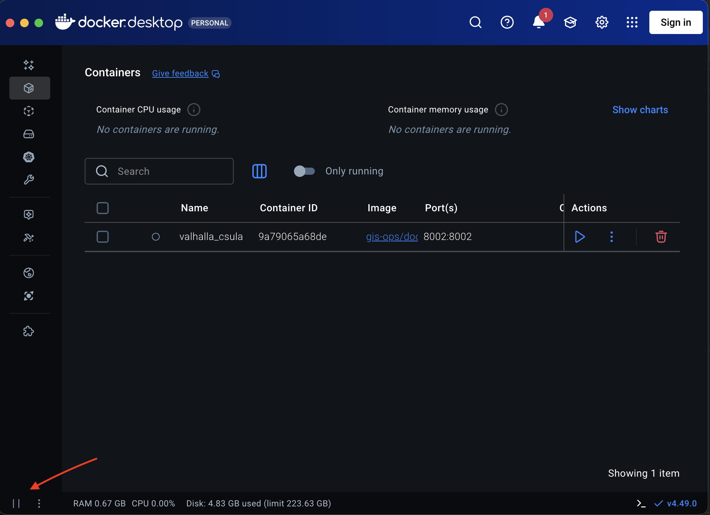
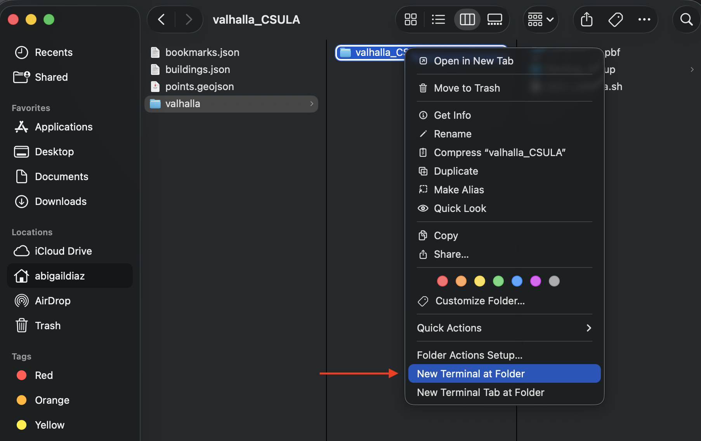
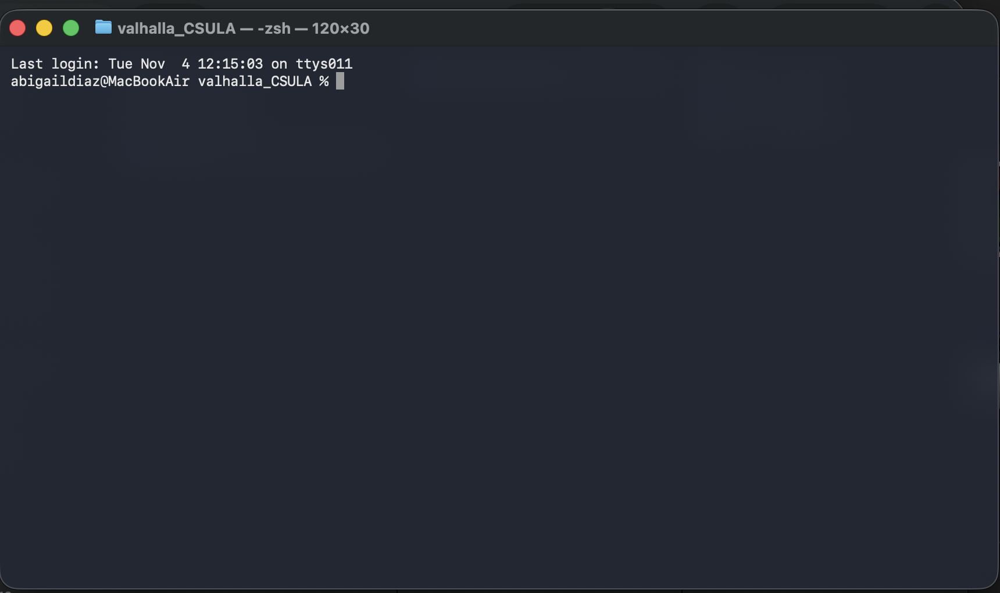

# Valhalla Server for CSULA Campus

This directory contains the OpenStreetMap data and scripts to run a local Valhalla routing server for Cal State LA campus navigation.

*Overview of the Valhalla routing server setup*

---

**Prerequisites:** Docker Desktop must be installed and running

### macOS/Linux:
```bash
# Open Terminal
cd "assets/data/valhalla/valhalla_CSULA"
chmod +x start_valhalla.sh
./start_valhalla.sh
```

### Windows:
```powershell
# Open PowerShell
cd "assets\data\valhalla\valhalla_CSULA"
.\start_valhalla.bat
```

Or simply **double-click** `start_valhalla.bat`

---

## 📋 Table of Contents
- [Prerequisites](#prerequisites)
- [Quick Start](#quick-start)
  - [macOS/Linux Setup](#macoslinux-setup)
  - [Windows Setup](#windows-setup)
- [Verifying the Server](#verifying-the-server)
- [Testing Routes](#testing-routes)
- [Stopping the Server](#stopping-the-server)
- [Troubleshooting](#troubleshooting)
- [Understanding the Setup](#understanding-the-setup)
- [Files in This Directory](#files-in-this-directory)

---

## Prerequisites

- **Docker Desktop** installed and running
  - Download: [docker.com/products/docker-desktop](https://www.docker.com/products/docker-desktop)
- **2-4GB free disk space** (for tiles generation)
- **Internet connection** (first-time Docker image download ~500MB)


*Make sure Docker Desktop is running before starting*

⚠️ Getting "docker: command not found"?
Docker is not in your system PATH
Easiest solution: Use Docker Desktop's terminal (click >_ icon in Docker Desktop on the bottom right corner)
Better solution: Fix your PATH (see troubleshooting)

---

## Installing Docker Desktop

### macOS Installation

1. **Download Docker Desktop:**
   - Visit [docker.com/products/docker-desktop](https://www.docker.com/products/docker-desktop)
   - Click "Download for Mac"
   - Choose your chip type:
     - **Apple Silicon** (M1, M2, M3, M4) - Most newer Macs
     - **Intel Chip** - Older Macs

   ![Docker Download Page]
   *Select the correct version for your Mac*

2. **Install Docker Desktop:**
   - Open the downloaded `Docker.dmg` file
   - Drag Docker icon to Applications folder
   - Open Docker from Applications
   
   ![Docker Installation]
   *Drag Docker to Applications folder*

3. **Start Docker:**
   - Docker may ask for system permissions - click "OK"
   - Wait for Docker to start (whale icon appears in menu bar)

   
   *Docker running in macOS menu bar*

4. **Verify Installation:**
   ```bash
   docker --version
   ```
   
   Should show something like: `Docker version 24.0.x`
   
   ```bash
   docker ps
   ```
   
   Should show empty list (no error)

---

### Windows Installation

1. **Download Docker Desktop:**
   - Visit [docker.com/products/docker-desktop](https://www.docker.com/products/docker-desktop)
   - Click "Download for Windows"

   *Download Docker Desktop for Windows*

2. **Run the Installer:**
   - Double-click `Docker Desktop Installer.exe`
   - Follow the installation wizard
   - **Important:** Keep "Use WSL 2 instead of Hyper-V" checked (recommended)

   *Docker Desktop installation wizard*

3. **Restart Your Computer:**
   - Docker will prompt you to restart - click "Close and restart"

4. **Start Docker Desktop:**
   - Open Docker Desktop from Start Menu
   - Accept the service agreement
   - Docker may take 2-3 minutes to start the first time
   - Wait for "Docker Desktop is running" message

5. **Verify Installation:**
   
   Open PowerShell or Command Prompt:
   ```powershell
   docker --version
   ```
   
   Should show: `Docker version 24.0.x`
   
   ```powershell
   docker ps
   ```
   
   Should show empty list (no error)

   
   *Docker Desktop running on Windows*

---

### Linux Installation (Ubuntu/Debian)

1. **Update package index:**
   ```bash
   sudo apt-get update
   ```

2. **Install prerequisites:**
   ```bash
   sudo apt-get install ca-certificates curl gnupg lsb-release
   ```

3. **Add Docker's official GPG key:**
   ```bash
   sudo mkdir -p /etc/apt/keyrings
   curl -fsSL https://download.docker.com/linux/ubuntu/gpg | sudo gpg --dearmor -o /etc/apt/keyrings/docker.gpg
   ```

4. **Set up the repository:**
   ```bash
   echo \
     "deb [arch=$(dpkg --print-architecture) signed-by=/etc/apt/keyrings/docker.gpg] https://download.docker.com/linux/ubuntu \
     $(lsb_release -cs) stable" | sudo tee /etc/apt/sources.list.d/docker.list > /dev/null
   ```

5. **Install Docker Engine:**
   ```bash
   sudo apt-get update
   sudo apt-get install docker-ce docker-ce-cli containerd.io docker-compose-plugin
   ```

6. **Verify Installation:**
   ```bash
   sudo docker --version
   sudo docker ps
   ```

7. **Optional - Run without sudo:**
   ```bash
   sudo usermod -aG docker $USER
   ```
   Then log out and back in.

---

### Common Docker Installation Issues

#### "Docker command not found" after installation

**macOS/Linux:**
- Docker Desktop may not have added itself to PATH
- Try restarting your terminal
- Or run: `open -a Docker` (macOS) to start Docker Desktop

**Windows:**
- Restart PowerShell/Command Prompt after installation
- Make sure Docker Desktop is running (check system tray)

---

#### macOS: "Docker Desktop requires privileged access"

**Solution:** 
- Click "OK" when prompted
- Enter your Mac password
- This is normal and required for Docker to work

---

## Quick Start

### macOS/Linux Setup

1. **Open Terminal**
   
   ⚠️ **Important:** Use your system terminal, NOT VS Code's integrated terminal
   - **macOS:** Use Terminal.app
   - **Linux:** Use your system terminal (Gnome Terminal, Konsole, etc.)
   
   **Why?** VS Code's terminal may not have Docker in its PATH. If you get "docker: command not found" in VS Code or terminal, use docker terminal instead or go to troubleshooting to fix PATH.

2. **Navigate to this directory:**
   
   use the full path:
   ```bash
   cd "/path/to/Eagle-Nav/eaglenav/assets/data/valhalla/valhalla_CSULA"
   ```
   
   **Tip to quickly navigate to directory:** Right-click the folder in VS Code → "Reveal in Finder" (macOS) or "Reveal in File Explorer" (Linux), then open Terminal from there.

   
   

3. **Make the startup script executable** (first time only):
   ```bash
   chmod +x start_valhalla.sh
   ```

4. **Start Valhalla server:**
   ```bash
   ./start_valhalla.sh
   ```
   
   The script will automatically:
   - Check if Docker is installed and running
   - Verify the CSULA.osm.pbf file exists
   - Remove any old containers
   - Free up port 8002 if needed
   - Start the server
   
   
   *Starting the Valhalla server from Terminal*

5. **Wait for build to complete** (~2-5 minutes on first run):
   
   You'll see output like:
   ```
   Checking prerequisites...
   Docker is installed and running
   CSULA.osm.pbf found
   Starting Valhalla server...
   Container started successfully
   Watching build progress...
   
   [INFO] Building tiles from CSULA.osm.pbf...
   [INFO] Tiles build complete!
   [INFO] Valhalla is ready!
   ```

6. **Press `Ctrl+C`** to stop watching logs (server keeps running in background)
   or press stop on the container's Action section in Docker Desktop.

---

### Windows Setup

1. **Open PowerShell or Command Prompt**

   - Press `Win + X` and select "Windows PowerShell" or "Terminal"
   - Or search for "PowerShell" in Start Menu
   
   **Note** VS Code's terminal may not have Docker in its PATH if it was not set during intallation. If you get "docker: command not found" in VS Code, use Windows PowerShell instead. If that does not solve the issue, use Docker Desktop terminal. For a more permanent solution, see the troubleshooting section.

2. **Navigate to this directory:**
   ```powershell
   cd "assets\data\valhalla\valhalla_CSULA"
   ```
   
   Or use the full path:
   ```powershell
   cd "C:\Users\YourName\assets\data\valhalla\valhalla_CSULA"
   ```
   
   **Tip:** Right-click the folder in VS Code → "Reveal in File Explorer", then type `powershell` in the address bar.

3. **Start Valhalla server:**
   
   **Simply double-click:** `start_valhalla.bat`
   
   Or run from command line:
   ```cmd
   start_valhalla.bat
   ```
   
   The script will automatically:
   - Check if Docker is installed and running
   - Verify the CSULA.osm.pbf file exists
   - Remove any old containers
   - Free up port 8002 if needed
   - Start the server

4. **Alternative - Manual Docker Command:**
   
   If you prefer to run Docker directly:
   
   **PowerShell:**
   ```powershell
   docker run -dt --name valhalla_csula -p 8002:8002 -v "${PWD}:/custom_files" -e force_rebuild=True ghcr.io/gis-ops/docker-valhalla/valhalla:latest
   ```
   
   **Command Prompt:**
   ```cmd
   docker run -dt --name valhalla_csula -p 8002:8002 -v "%cd%:/custom_files" -e force_rebuild=True ghcr.io/gis-ops/docker-valhalla/valhalla:latest
   ```

4. **Watch the build progress:**
   ```cmd
   docker logs -f valhalla_csula
   ```
---

## Verifying the Server

### Check Server Status

**macOS/Linux:**
```bash
curl http://localhost:8002/status
```

**Windows (PowerShell):**
```powershell
Invoke-WebRequest -Uri http://localhost:8002/status
```

**Windows (Command Prompt):**
```cmd
curl http://localhost:8002/status
```

**Expected response:**
```json
{"version":"3.5.1","tileset_last_modified":1762288241,"available_actions":["status","centroid","expansion","transit_available","trace_attributes","trace_route","isochrone","optimized_route","sources_to_targets","height","route","locate"]}
```

### Check Docker Desktop

Open Docker Desktop and verify:
- Container `valhalla_csula` is running (green indicator)
- Port 8002 is mapped


*Valhalla container running in Docker Desktop*

---

## Testing Routes

Test with a sample route request:

**macOS/Linux:**
```bash
curl -X POST http://localhost:8002/route \
  -H "Content-Type: application/json" \
  -d '{
    "locations": [
      {"lat": 34.0689, "lon": -118.1688},
      {"lat": 34.0655, "lon": -118.1675}
    ],
    "costing": "pedestrian"
  }'
```

**Windows (PowerShell):**
```powershell
$body = @{
  locations = @(
    @{lat=34.0689; lon=-118.1688},
    @{lat=34.0655; lon=-118.1675}
  )
  costing = "pedestrian"
} | ConvertTo-Json

Invoke-WebRequest -Uri http://localhost:8002/route -Method POST -Body $body -ContentType "application/json"
```

You should receive a JSON response with route geometry and instructions.

---
## Testing Routing on Flutter App and Androuid Emulator
# Make sure the emulator is running

# update dependencies
```bash
flutter pub get
```

# run the flutter app
```bash
flutter run
```

---
## Commands to keep in mind

## Stopping the Server

**Stop the container:**
```bash
docker stop valhalla_csula
```

**Remove the container** (keeps generated tiles):
```bash
docker rm valhalla_csula
```

**Restart existing container:**
```bash
docker start valhalla_csula
```

---

## 🔧 Troubleshooting Flowchart

```
Getting "docker: command not found"?
├─ In VS Code terminal?
│  └─ ✅ Use docker terminal instead
│
├─ In system terminal?
   ├─ Docker Desktop not installed?
   │  └─ ✅ Install Docker Desktop (see installation section)
   │
   ├─ Docker Desktop not running?
   │  └─ ✅ Start Docker Desktop app
   │
   └─ Docker installed but still not found?
      └─ ✅ Restart terminal after Docker installation
```

---

## Troubleshooting

### "docker: command not found" in VS Code Terminal

## Fix for macOS

### Option 1: Reinstall Docker Desktop (Easiest)

1. Quit Docker Desktop completely
2. Download fresh installer from [docker.com](https://www.docker.com/products/docker-desktop)
3. Run installer - it should automatically add Docker to PATH
4. Restart your Mac
5. Test in Terminal.app: 
   ```bash
   docker --version
   ```

---

### Option 2: Manually Add to PATH (Recommended for permanent fix)

1. **Find Docker location:**
   ```bash
   ls -la /Applications/Docker.app/Contents/Resources/bin/docker
   ```

2. **Add to your shell profile:**
   
   **For zsh (default on modern macOS):**
   ```bash
   echo 'export PATH="/Applications/Docker.app/Contents/Resources/bin:$PATH"' >> ~/.zshrc
   source ~/.zshrc
   ```
   
   **For bash:**
   ```bash
   echo 'export PATH="/Applications/Docker.app/Contents/Resources/bin:$PATH"' >> ~/.bash_profile
   source ~/.bash_profile
   ```

3. **Restart Terminal and test:**
   ```bash
   docker --version
   ```

4. **Restart VS Code**

**Windows:**
1. Docker Desktop should add itself to PATH automatically
2. Try restarting VS Code after Docker Desktop installation
3. If still not working, use system PowerShell

*Use docker terminal if Docker doesn't work in VS Code or system terminal*

---

### "Container name already in use"

**Solution:** Remove the old container first:
```bash
docker rm -f valhalla_csula
```
Then start again.

---

### "Port 8002 is already allocated"

**Solution:** Another service is using port 8002. Either:
1. Stop that service, or
2. Use a different port (change `-p 8002:8002` to `-p 8003:8002` and update your app config)

---

### "Cannot connect to Docker daemon"

**Solution:** Make sure Docker Desktop is running.

---

### Server builds but routes fail

**Solution:** 
1. Check logs: `docker logs valhalla_csula`
2. Verify the `CSULA.osm.pbf` file is present
3. Force rebuild: Add `-e force_rebuild=True` to the docker command
4. Rebuild a new server. Delete all files within the Valhalla_CSULA folder
except the required three files: CSULA.osm.pbf, start_valhalla.bat, start_valhalla.sh.

---

### Can't access from Android Emulator

**Solution:** Use `http://10.0.2.2:8002` instead of `http://localhost:8002`
- This is already configured in `app_config.dart`
- `10.0.2.2` is the special IP that emulators use to reach the host machine

---

## Understanding the Setup

### What's the Bind Mount?

The `-v` flag creates a **bind mount** that connects your local files to the container:

**macOS/Linux:** `-v "$(pwd)":/custom_files`
**Windows:** `-v "${PWD}:/custom_files"` or `-v "%cd%:/custom_files"`

This means:
- Container can read your `CSULA.osm.pbf` file
- Generated files are saved to **your machine** (not inside the container)
- Files persist even if you delete the container
- Automatically uses your current directory

### Important Notes

**Always run from the correct directory!**
- The script uses your current directory (`pwd` or `PWD`)
- If you're in the wrong folder, it won't find `CSULA.osm.pbf`
---

## Files in This Directory

### Source Files
- `CSULA.osm.pbf` - OpenStreetMap data for CSULA campus
- `start_valhalla.sh` - Startup script (macOS/Linux)
- `start_valhalla.bat` - Startup script (Windows)
- `README.md` - This file

### Generated Files (ignored by git)
- `valhalla_tiles/` - Routing graph tiles (~500MB)
- `valhalla_tiles.tar` - Compressed tiles
- `valhalla.json` - Server configuration
- Various build logs and temp files

**⚠️ Don't commit generated files!** They're large and automatically rebuilt from `CSULA.osm.pbf`

---

## What Happens on First Run

1. Docker downloads the Valhalla image (~500MB, one-time)
2. Container starts and mounts your directory
3. Valhalla reads `CSULA.osm.pbf`
4. Builds routing tiles (~2-5 minutes)
5. Saves tiles to `valhalla_tiles/` on your machine
6. Server is ready at `http://localhost:8002`

**Subsequent runs:** Start in ~5 seconds.

---

## Need Help?

- Check Docker Desktop is running
- Verify you're in the correct directory
- Check the troubleshooting section above
- View container logs: `docker logs valhalla_csula`

---

**🎓 Built for Eagle-Nav @ Cal State LA**
